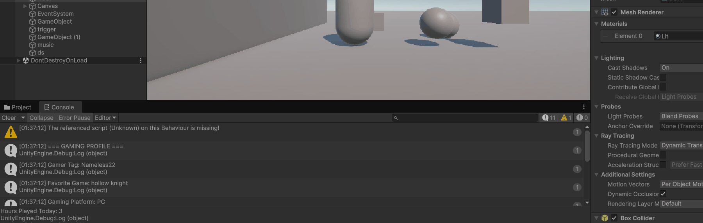
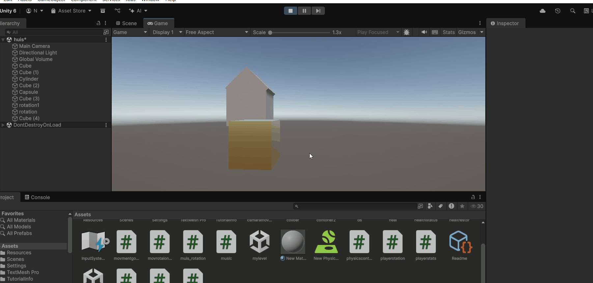
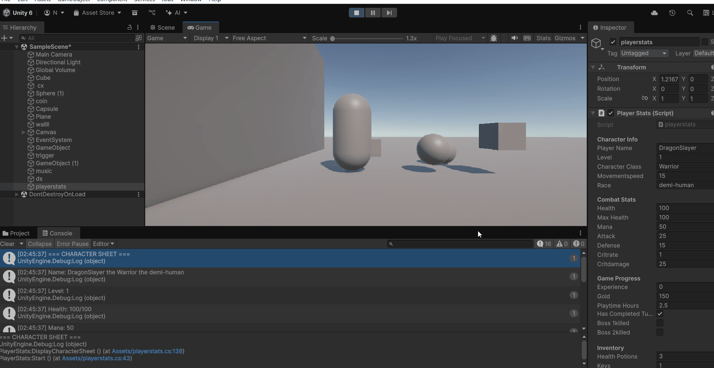
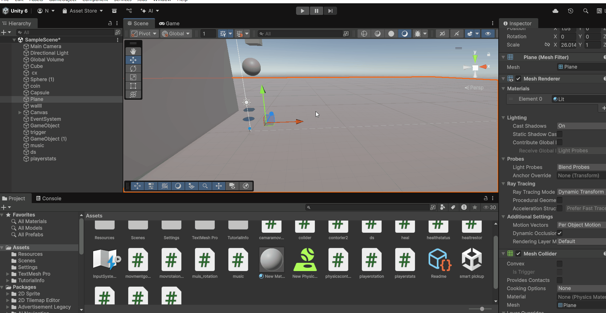
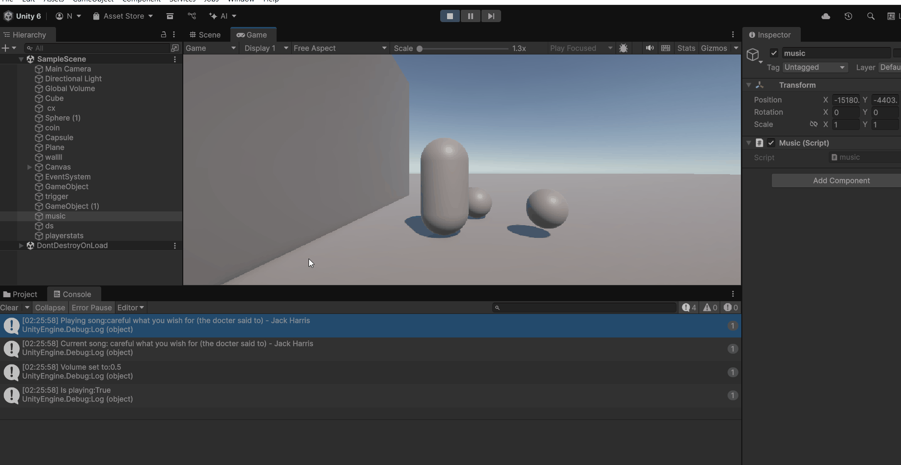
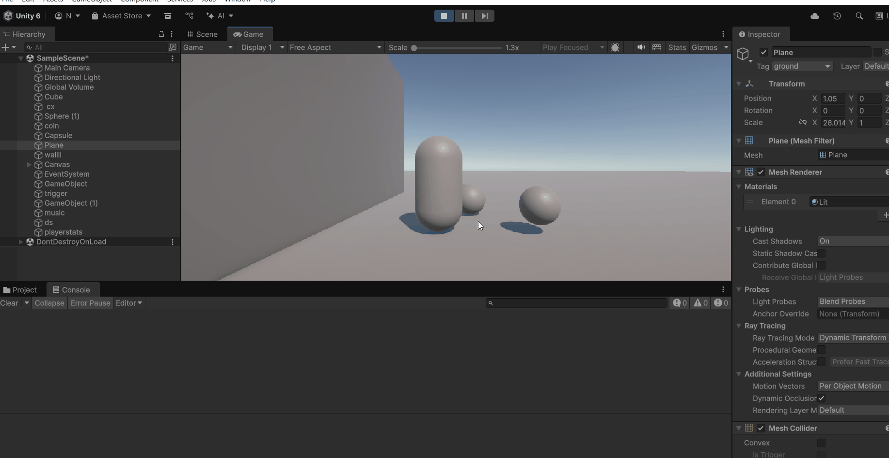
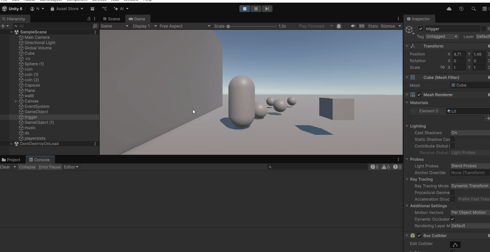
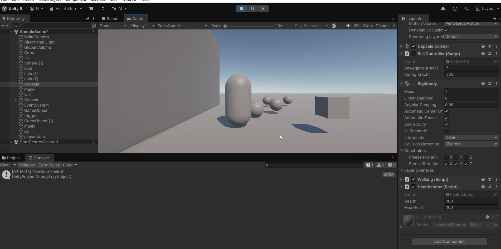
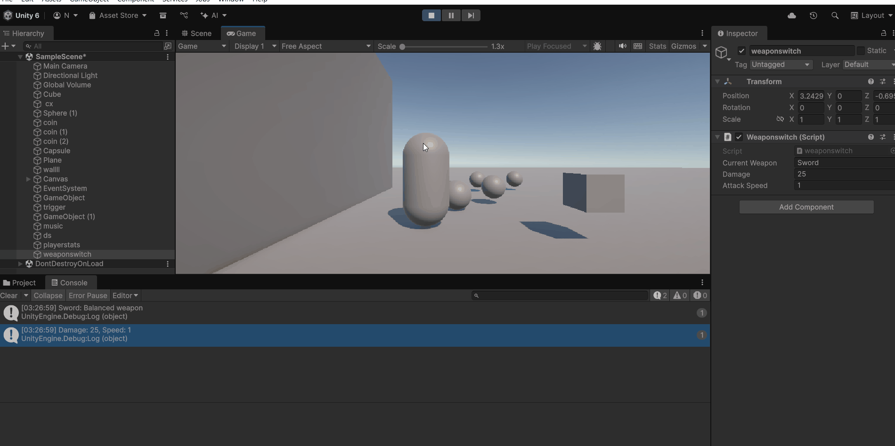
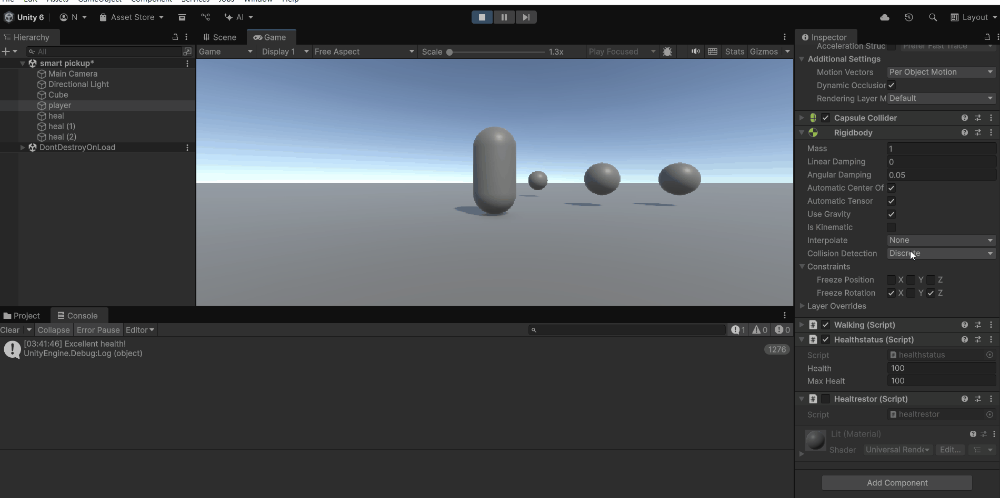

# gdv_unity

# 1.1A huis
## 
 no code

# 1.2A Personal Gaming Profile Generator
## 
### [code](Assets/ds.cs)

# 2.1A rotation coin 
## 
### [code](Assets/upanddown.cs) 

# 2.2A playerstats
## 
### [code](Assets/playerstats.cs)

# 3.1A Vallende bal met stuiter
## 
### no code

# 3.2A  Muziek Speler
## 
### [code](Assets/music.cs)

# 4.1A coin colider
## 
### [player code](Assets/walking.cs)     
[coin code](Assets/colider.cs)

# 4.2B damage zone
## 
### [player code](Assets/walking.cs)    
### [damage zone code](Assets/triggerit.cs)
 

# 5.1A Health status
## 
### [code](Assets/healthstatus.cs)

# 5.1B weapon switch
## 
### [code](Assets/weaponswitch.cs)

# 5.2A Slimme Pickup Systeem
## 
### [player movement code](Assets/walking.cs) 
### [player health status code](Assets/healthstatus.cs)
### [smart pickup code](Assets/heal.cs)

# 6.1 my level
## 
### [movement code](Assets/playermovent.cs)
### [camarra rotation code](Assets/muisrotation2.cs)